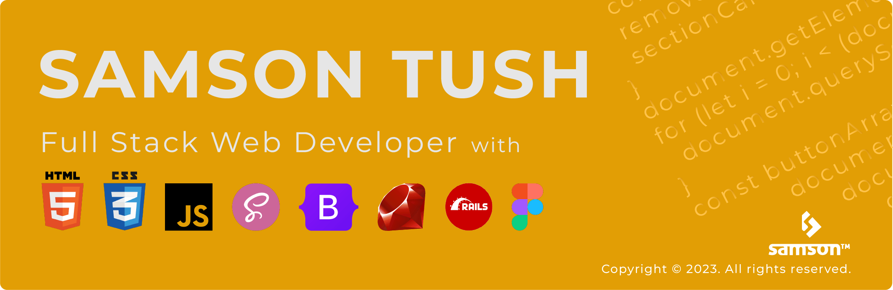

# Hi, I'm Samson, 
### A Full Stack Web Developer 
#### with a Bachelors of Science in Computer Science and too much love for front-end development.

##   Connect with Me

&nbsp; &nbsp; &nbsp; &nbsp;

&nbsp; &nbsp;

&nbsp; &nbsp;

&nbsp; &nbsp;

<h2></h2>

 ##   GitHub Stats
  

<table><tr><td width="50%" margin-left="100"></td><td width="50%"></td></tr></table>

<h2></h2>

  ##  Technologies & Skills
  
  
<table><tr>
 <td width="65%">
  
  ***Front-End***: HTML5, CSS3, sass, Bootstrap, JavaScript, jQuery, React, Figma, Photoshop, illustrator 
  **Back-End**: Ruby, Ruby on Rails  
  **Tools & Methods**: Git, Github, Gitflow, vscode, Chrome Dev Tools  
  **Professional**: Freelance Programmer, Remote Pair-Programming   
  
 </td>
 <td width="35%"></td></tr></table>

  

  

